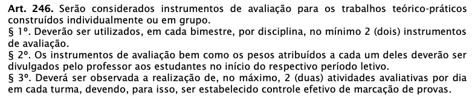
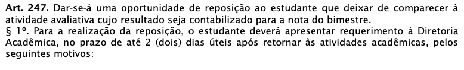
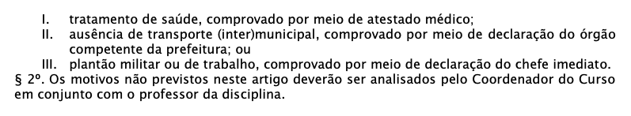
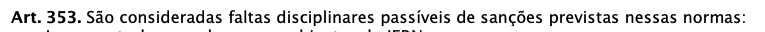
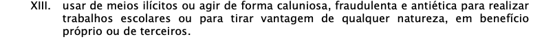

# Apresentação

---

## Apresentação

- Aulas
- Avaliação
- Materiais
- Tecnologias
- Código de conduta
- Ementa

---
## Aulas

- Todas as aulas são em laboratório
- A disciplina exige a escrita de código para construção de projetos
- Os códigos são parte fundamental do processo
- Importante notar que há bastante teoria por trás de cada projeto/código escrito

---

## Avaliação

- Avaliação individual
- Projetos
- Prática Profissional
  - Projeto Integrador + Projeto de Pesquisa(Extensão)

---

## Materiais

- Livros disponibilizados gratuitamente
- Conteúdo de blogs
- Vídeos no Youtube

**Observação**: não há material didático para disciplina. É necessário que busquemos alternativas na web para sanar essse problema.

---

## :computer: Tecnologias

- [Django](https://www.djangoproject.com/) 4.*
- [Python](https://www.python.org/) 3.12.*
- [git](https://git-scm.com/) + [github](https://github.com/) / [gitlab](https://about.gitlab.com/)
- Docker (opcional): o aluno pode solicitar assistência a parte

**Observação**: Podemores adicionar mais conforme avançarmos.

---

## :grey_exclamation: Código de Conduta

Fonte: [Organização Didática - IFRN, 2024](https://portal.ifrn.edu.br/documents/17567/Organiza%C3%A7%C3%A3o_Did%C3%A1tica_do_IFRN_0xctych.pdf)

---

## :grey_exclamation: Código de Conduta

Fonte: [Organização Didática - IFRN, 2024](https://portal.ifrn.edu.br/documents/17567/Organiza%C3%A7%C3%A3o_Did%C3%A1tica_do_IFRN_0xctych.pdf)

---

## Código de Conduta

Fonte: [Organização Didática - IFRN, 2024](https://portal.ifrn.edu.br/documents/17567/Organiza%C3%A7%C3%A3o_Did%C3%A1tica_do_IFRN_0xctych.pdf)

Em resumo: <strong>cola.</strong>

---

## Código de Conduta

- :no_mobile_phones: Uso de smartphone (**Proíbido por lei**)
- Jogos durante as aulas
- Muita saída de laboratório
- Realizar outros trabalhos em laboratório

---

# :book: Ementa 

---

## Ementa

- Conceitos de sistemas web 
  - Introdução ao serviço HTTP
  - Ativação por solicitações GET e POST
  - Formulários e componentes básicos
  - Criação de páginas dinâmicas
 
---

## Ementa

- Controle de estado
  - QueryString
  - Cookies
  - Controle de sessão
  - Estado da página

---

## Ementa

- Controle de acesso
   - Autenticação e autorização

- Acesso a bancos de dados
  - Componentes de acesso a dados
  - Componentes de apresentação
  - Mapeamento objeto-relacional
  - Linguagens de consulta

---

## Ementa

- Padrão MVC
  - Introdução aos conceitos básicos
  - Aplicando MVC a sistemas web
- Programação no cliente com linguagem JavaScript
  - Características da linguagem
  - Frameworks e plugins
  - Ajax
- Framework de desenvolvimento ágil: Relatórios e gráficos

---

# Referência

---

## Referência

BEAZLEY, D.; JONES, B. K. Python cookbook: Recipes for mastering python 3. 3. ed. [s.l.] O’Reilly Media, 2013.

Pense em Python. Disponível em: https://penseallen.github.io/PensePython2e/. Acesso em: 17 jan. 2024.

RAMALHO, L. Python fluente: Programação clara, concisa e eficaz. [s.l.] Novatec Editora, 2015. https://pythonfluente.com/.

SHAW, B. et al. Web Development with Django: A definitive guide to building modern Python web applications using Django 4. 2. ed. Birmingham, England: Packt Publishing, 2023.