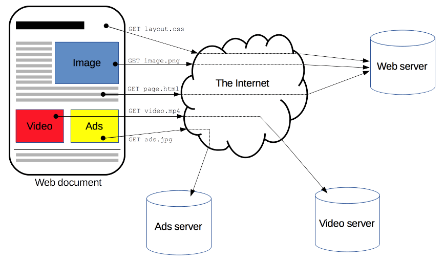
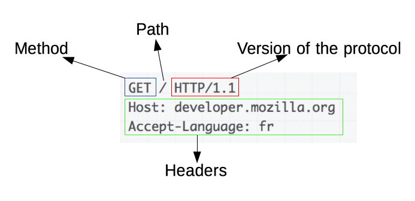

# Protocolo HTTP

---

## Protocolo HTTP

- Protocolo HTTP
- Métodos GET / POST
- Web Browser
    - Analisar requests
- Request / Response

---

# Protocolo HTTP

---

## Introdução ao HTTP

- HTTP = **Hyper Text** Transfer Protocol
  - Protocolo de Transferência de Hipertexto
  - *Hipertexto não é exclusivo do meio digital*

- É a base da web e permite obter recursos como documentos HTML

- Hypertext: [Vídeo sobre Hipertexto](https://www.youtube.com/watch?v=7bF6SwRqcFg)
  
- Hypermedia: [Vídeo sobre Hipermídia](https://www.youtube.com/watch?v=yfJrNnNLDbY)

---

## Introdução ao HTTP

Fonte: https://estertecnoeducacao.blogspot.com/2012/06/o-uso-da-tecnologia-na-educacao.html

---

## Introdução ao HTTP

- É um protocolo de camada de aplicação para transmissão de documentos hipermídia
- Baseado em um modelo ***client-server*** (cliente e servidor)
- Tem como base pedidos realizados por clientes:
  - ***Requests*** (requisições)
- É um protocolo sem estado
  - O servidor não mantém informações entre requisições
---

## Introdução ao HTTP

Fonte: https://developer.mozilla.org/pt-BR/docs/Web/HTTP/Overview

---

## Introdução ao HTTP

- HTTP é o protocolo que permite obter **recursos**
  - Documentos HTML
  - Imagens
  - PDF etc

- As requisições sempre são iniciadas pelo cliente
- Um cliente pode ser um navegador Web ou um comando como [curl](https://curl.se/).

---

## Introdução ao HTTP

Fonte: própria.

---

# Recursos, URL, URI

---
## Recursos, URL, URI

- Recursos são elementos com os quais interagimos na Web, tais como: **imagens**, **páginas**, **arquivos** e **vídeos**. 

- **URI (Uniform Resource Identifier)**
  - Idenfiticador uniforme de recurso
  - descreve o mecanismo para localizar um recurso físico ou lógico
  - No contexto da web os recursos são: *páginas, arquivos etc.*

---

## Recursos, URL, URI

- Exemplos de URI: [RFC3986](https://www.ietf.org/rfc/rfc3986.txt).
  - ftp://ftp.is.co.za/rfc/rfc1808.txt
  - http://www.ietf.org/rfc/rfc2396.txt
  - ldap://[2001:db8::7]/c=GB?objectClass?one
  - mailto:John.Doe@example.com
  - tel:+1-816-555-1212
  - telnet://192.0.2.16:80/

RFC (Request for Comments) são documentos técnicos relacionados a especificação de como funciona a Internet <a href="">(CARVALHO, 2002)</a>.

---

## Recursos, URL e URI

- URL (Uniform Resource Locator): Localizador de recurso uniforme
- **Informa um recurso e o protocolo utilizado para acessá-lo.**

Se podemos tratar uma página como recurso, então utilizando o protocolo HTTP solicitamos (request) esta página via navegador.

- Utilizamos uma URL para isso:
  https://suap.ifrn.edu.br/

---

## Recursos, URL e URI

- O conceito de URI é mais abrangente. Pode fazer referências a recursos de qualquer natureza (lógico ou físico): **Identifica qualquer recurso, online ou offline**

- O conceito de URL é usado no contexto da WEB: **Identifica recursos na internet**.

- Todo URL é um URI. O contrário não é sempre verdade.

Veja mais sobre isso [Aqui](https://www.hostinger.com.br/tutoriais/uri-e-url?utm_campaign=Generic-Tutorials-DSA|NT:Se|LO:BR-t4&utm_medium=ppc&gad_source=1&gclid=CjwKCAjwktO_BhBrEiwAV70jXlW9rEfw26M44koabeogSySSV5Nkb5BNEfcdZTDKYikTQ-hdIZQm7BoCrSAQAvD_BwE).

---

## Recursos, URL e URI

Fonte: própia.

---

## Recursos, URL e URI

- Há outros elementos em um endereço. Vejamos o seguinte exemplo:

https://stackoverflow.com/questions/99934/ 

- O endereço acima abre uma questão no stack de 15 anos atrás.
- É possível ficar alterando o número 99934 para ver questões aleatoriamente.
- **Neste exemplo, há duas informações importantes: URL path e Query String**

---

## Recursos, URL e URI

Fonte: própria

---

# Requesições (Request)

---

## Requesições (Request)

- O que compõe uma requisição?

  - Método ou verbo HTTP: GET, POST são os exemplos mais comuns
  - O caminho do recurso (HOST + URL PATH)
  - Versão do protocolo HTTP
  - Cabeçalhos (Headers) que contém informações adicionais para o servidor

---

## Requisições (Request)

**Fonte**: https://developer.mozilla.org/pt-BR/docs/Web/HTTP/Overview#fluxo_http

---

## Respostas (Response)

- Por outro lado, as respostas indicam:
  - Versão do protocolo
  - **Código de Status** e mensagem de status
  - Cabeçalhos
  - Opcionalmente um corpo de dados (página, por exemplo)

---

## Respostas (Response)

**Fonte**: https://developer.mozilla.org/pt-BR/docs/Web/HTTP/Overview#fluxo_http

---

## Práticas

- Solicitando recursos online:
  - [Serviço](https://reqbin.com/)
- Levantar servidor local
  `python -m http.server`
- Analisar os dados das requisições e respostas na guia network do navegador

---

## Resumo

- Protocolo HTTP – protocolo pra transferência de Hypertext
- É a base da comunicação na Web
- Permite a requisição de recursos
- Requisições são individuais
- As requisições sempre são realizadas pelo lado cliente
- Define-se o nome do cliente como User-Agente (agente de usuário)
- A requisição nunca inicia do lado do servidor

---

## Resumo

- Localizamos **recursos** na web através de **URL**
- As URL's são compostas por **domínio**(host), **URL paths**, **QueryStrings**
- AS requisições para os recursos devem indicar o protocolo, **o verbo HTTP** e opcionalmente cabeçalhos(headers)
- As respostas devolvem o recurso solicitado, indicam protocolo e demais informações via cabeçalhos.

---
##  Referências

CONCURSEIRO, E. S. UM. O que são URI, URL e URN? Disponível em: <https://techenter.com.br/o-que-sao-uri-url-e-urn/>. Acesso em: 27 feb. 2024.

COSTA, M. B. O que é HTTP. Disponível em: <https://canaltech.com.br/internet/o-que-e-http/>. Acesso em: 27 feb. 2024.

HTTP: o que é e como funciona o protocolo por trás da Web. Disponível em: <https://www.alura.com.br/artigos/desmistificando-o-protocolo-http-parte-1>. Acesso em: 27 feb. 2024.

Uma visão geral do HTTP. Disponível em: <https://developer.mozilla.org/pt-BR/docs/Web/HTTP/Overview>. Acesso em: 27 feb. 2024.

CARVALHO, C. O que é um RFC? Disponível em: <https://canaltech.com.br/internet/o-que-e-um-rfc/>. Acesso em: 8 apr. 2025.

SANTANA, B. URI e URL: Qual a Diferença e Quando Usar Cada Um. Disponível em: <https://www.hostinger.com.br/tutoriais/uri-e-url?utm_campaign=Generic-Tutorials-DSA|NT:Se|LO:BR-t4&utm_medium=ppc&gad_source=1&gclid=CjwKCAjwktO_BhBrEiwAV70jXlW9rEfw26M44koabeogSySSV5Nkb5BNEfcdZTDKYikTQ-hdIZQm7BoCrSAQAvD_BwE>. Acesso em: 8 apr. 2025.

