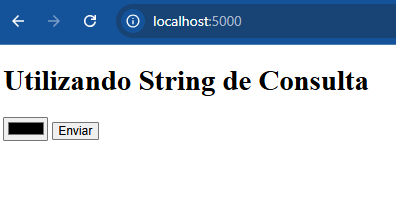
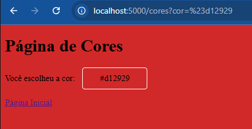
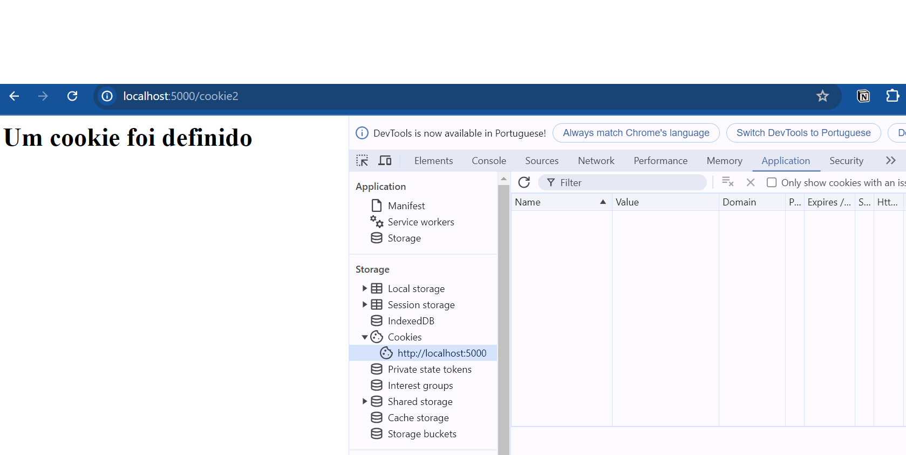
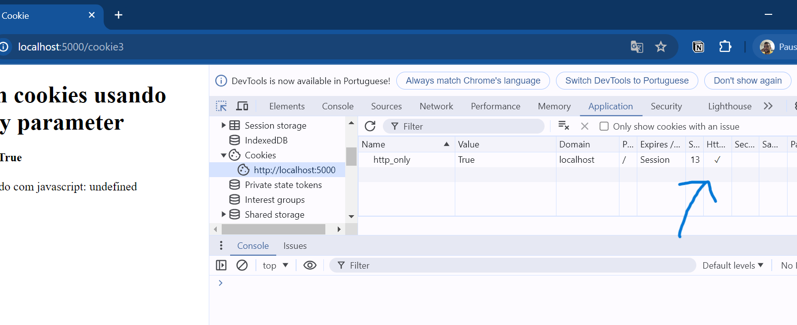

# String de Consulta e Cookies

---

## String de Consulta

- String de Consulta
- Formulários e `request`
- Cookies

---

## String de Consulta 

<style scoped>
    pre > * {
      font-size: 40px
    }
    pre {
        float: left;        
        width: 100%;
        margin-right: 5px;
        margin-top: 0px
    }
</style>

- Strings de consulta estão fortemente relacionadas ao médoto GET

- É possível ver sua composição na URL através da barra de navegação

- Podemos observar também na construção de links

```htm
http://localhost:5000/profile?name=joao&sname=jj
```

---

## String de Consulta

<style scoped>
    pre > * {
      font-size: 40px
    }
    pre {
        float: left;        
        width: 100%;
        margin-right: 5px;
        margin-top: 0px
    }
</style>

- Úteis para criação de filtros
- Envio de dados ao servidor (dados não-sensíveis)

```htm
http://localhost:5000/profile?name=joao&sname=jj
```

- String de consulta
  - Utiliza-se **?** seguido de pares **key=value** separados por **&**
```htm
/profile?name=joao&sname=jj
```

---

## String de Consulta

- O exemplo a seguir pode ser acessado neste link: [Exemplo 01](https://github.com/RomeritoCamposProjetos/web-2025/tree/main/slides/04/exemplo1)
- Ele consiste em uma aplicação simples que permite escolher cores via string de consulta ou via formuláro (com método GET)
- Ao escolher uma cor, a página de cores será modificada para ter a propriedade CSS `background-color` associada a cor escolhida.

- **Funcionamento da aplicação**: acessar a página inicial. Escolher uma cor no formulário disponível e enviar. Na página de aplicação da cor, é possível voltar para página inicial.
---

## String de Consulta

- O uso de string de consulta está relacionado ao método GET e a construção da URL, especificamente o caminhho do recurso.
- No exemplo da cores teremos:

```markdown
localhost:5000/cores?cor=blue
```

- Neste caso, temos a string de consulta: `cor=blue`
- Já sabemos que a requisição foi via GET (seja por formulário ou não).
- No código da aplicação, não há nada especial para definir uma string de consulta.

---

## String de Consulta

- Código da aplicação:

```python
from flask import Flask, render_template, request

app = Flask(__name__)

@app.route('/')
def index():
    return render_template('index.html')

@app.route('/cores')
def cores():
    cor_obtida = request.args.get('cor')
    return render_template('cores.html', cor=cor_obtida)
```

---

## String de Consulta

- O formulário de acesso é este:

<div class="wrapper">



Fonte: própria.

</div>


---

## String de Consulta

- Quando uma cor for escolhida e o botão enviar for pressionado: temos uma requisição HTTP GET.
- No lado do servidor, teremos uma rota específica aguardando requisições GET deste formulário. **Analisando o atributo `action` do formulário sabaremos disso.**
```html
<form action="{{ url_for('cores') }}" method="get">
    <input type="color" placeholder="Digite uma cor válida" name="cor">
    <button>Enviar</button>
</form>
```
- Utilizamos a função `url_for` indincando que um endereço válido seja gerado para a rota que possui a `view` chamada **cores**

---

## String de Consulta

- Para a acessar toda a string de consulta, sugiro testar a opção: `request.query_string`
- Neste exemplo, vamos direto ao ponto para pegar o parâmetro que desejamos: `cor`
- Essa informação vem do formulário:

```html
<input type="color" placeholder="Digite uma cor válida" name="cor">
```
- Vamos obtê-la conforme abaixo:
```python
cor_obtida = request.args.get('cor')
```

---

## String de Consulta

- Até aqui, obtivemos o dado que o usuário enviou. Agora é preciso aplicar na página de cores.
- Faremos isso passando a cor escolhida para a página `cores.html`
```python
return render_template('cores.html', cor=cor_obtida)
```
- No template `cores.html` poderemos utilizar a informação presente em `cor`. Veja trecho a seguir:

```htm
<body style="background-color: {{cor}};">
```

--- 

## String de Consulta

- Se você está acessando o código fonte no seu editor, é possível que esteja vendo um erro no arquivo `cores.html`. Especificamente, na linha apresentada no slide anterior.
- Isso se deve ao fato de o HTML não ter a sintaxe abaixo:
```htm
{{cor}};
```
- Essa sintaxe e outras mais é um recurso extra do Flask por meio do uso do [Jinja](https://jinja.palletsprojects.com/en/stable/) que amplia o que pode ser feito usando HTML. A funçaõ `render_template` se encarrega de resolver o trecho de código de exemplo.
- O mesmo ocorre com `url_for()` quando usado no HTML.

---

## String de Consulta

- A string de consulta é caracterizada pelo par `key=value`. Neste exemplo, ao executar a escolha de uma cor você vai se deparar com:

<div class="wrapper">



Fonte: própria.

</div>

---

## String de Consulta

- Observe a barra de navegação do exemplo anterior:

```markdown
http://localhost:5000/cores?cor=%23d12929
```

- O par `key=value` neste exemplo é: `cor=%23d12929`
- A página já tem a aplicação desta cor. 
- Observe que a cor escolhida está representada na página como um valor hexadecimal: `#d12929`.
- O símbolo `#` foi substituído por `%23` na URL já que se trata de um símbolo especial. Teste executar `cor=blue`

---

# Cookies

---

## Cookies - O que são?

- Os cookies são informações que o servidor pode armazenar no navegador do cliente (caso ele autorize de acordo com a [LGPD](https://www.planalto.gov.br/ccivil_03/_ato2015-2018/2018/lei/l13709.htm)).
- Eles são muito úteis para superar uma limitação do protocolo HTTP: não ter estado
- São pequenos pacotes de dados salvos como arquivos em nosso navegador que permitem uma melhor experiência na web e na comunicação com servidor
- Uma vez salvos no nosso navegador, podemos definir algumas propriedades do cookie que alteram seu comportamento

<p class="nota">
Os cookies que são definidos em nosso navegador sempre vão junto nas próximas requisições
</p>

---

## Cookies

**Algumas aplicações:**

- Gerenciar sessão de usuários
- Melhorar experiência por meio de personalizações
- Rastreamento
    - comportamento do usuário
    - cliques realizados
    - localização

---

## Cookies

- Os cookies são armazenados no navegador na parte de **Storage**
    - No google chrome você pode abrir a DevTools (Ctrl + Shift C ou F12)
    - Ir até Application (aplicação)
    - Abrir o Storage e acessar os Cookies

- Veja a imagem no próximo slide

---

## Cookies

<div class="wrapper">



Fonte: própria.

</div>

---

## Cookies

**Como podemos manipular cookies em Flask?**

- Acesso: Através do atributo `cookie` do objeto `request` 

- Definição de cookies: através do uso de objetos `response` e a função `set_cookie`

- Vejamos um simples exemplo

---

## Cookies

- Vejamos como definir um cookie em Flask através de exemplos práticos

- Os arquivos do projeto estão na pasta cookies:
    - **app.py**: define as rotas que criam os cookies
    - **templates**: mostra o arquivo `cookies.html` que permite interagir com o projeto

---

## Cookies

- [Exemplo 2](https://github.com/RomeritoCamposProjetos/web-2025/tree/main/slides/04/exemplo2)
- Definição de cookie de sessão
- Este cookie expira quando o navegador é fechado
---

## Cookies

- Código da página `cookies.html`: Exemplo 2.

```html
<!-- trecho de código -->
<h4>Definido cookie de sessão</h4>
<a href="{{ url_for('cookie1') }}">Cookie de Sessão</a>
```

```python
# rota que manipula a criação de cookie
@app.route("/cookie1")
def cookie1():
    text = "<h1>Um cookie foi definido<h1/>"
    response = make_response(text)
    response.set_cookie('primeiro_cookie', 'teste')
    return response
```

---

## Cookies

- No exemplo anterior, temos uma nova função que é `make_response`

- Note que a interação cliente-servidor é feita através de **request-response**

- Você pode estar em dúvida se `return render_template` é um **response**. O Flask vai produzir um response através deste retorno.

- Vamos criar manualmente o **response** para poder definir um cookie antes de dar a resposta ao usuário.

---

## Cookies

- Definição da string que será usada para retorno
`text = "<h1>Um cookie foi definido<h1/>"`
- Criação de um objeto `response` 
`response = make_response(text)`
- Uso da função set_cookie para enviar um cookie para o usuário
`response.set_cookie('primeiro_cookie', 'teste')`
- Aqui retorna-se um reponse(resposta) junto com o cookie que
`return response`

---

## Cookies

- [Exemplo 3](https://github.com/RomeritoCamposProjetos/web-2025/tree/main/slides/04/exemplo2)
- Criaremos um cookie permanente (enquanto o tempo de vida dele permitir)
- Mesmo fechando o navegador, o cookie permanece ativo.
- No segundo exemplo, vamos ter um formulário que envia o tempo de vida que atribuiremos ao cookie.

---

## Cookies

```html
<h4>Definiindo tempo de vida do cookie</h4>
<form action="{{url_for('cookie2')}}" method="post">
    <input type="text" placeholder="tempo em segundos" name="time">
    <input type="submit" value="Enviar">
</form>
```

```python
@app.route("/cookie2", methods=['POST'])
def cookie2():
    text = "<h1>Um cookie foi definido<h1/>"
    time = int(request.form['time'])
    response = make_response(text)
    response.set_cookie('primeiro_cookie', 'teste', max_age=time)
    return response
```

---

## Cookies

- No código HTML, temos um formulário simples que envia dados via HTTP POST: vamos enviar o tempo em segundos
- Obtemos o dado e convertemos para inteiro
`time = int(request.form['time'])`
- Criamos o response
`response = make_response(text)`
- Definimos o retorno
`response.set_cookie('primeiro_cookie', 'teste', max_age=time)`

---

## Cookies

<style scoped>
    table {
        font-size: 32px
    }
</style>

- Parâmetros adicionais para cookies

| Parâmetro | Caracaterísica                                               |
|-----------|--------------------------------------------------------------|
| httponly  | Não permite o acesso ao cookie via Javascript                |
| secure    | Indica que o cookie está diponível apenas em conexão HTTPS   |
| path      | Especifica um caminho para o cookie, por exemplo "/teste"    |
| domain    | Especifica um domínio específico, por exemplo www.domain.com |

---

## Cookies

- Os cookies podem ser definidos de maneira a evitar que eles sejam acessados via javscript no Nevegador

- Ao criarmos um cookie, podemos marcar o atributo `httponly` como `True`

- Desta maneira, o cookie fica acessível apenas no nivel de comunicação HTTP entre cliente e servidor

---

## Cookies

- [Exemplo 4](https://github.com/RomeritoCamposProjetos/web-2025/tree/main/slides/04/exemplo2): Neste exemplo temos o seguinte formulário:

```html
<!-- trecho de cookies.html -->
<h4>Usando o parâmetro httponly</h4>
<form action="{{url_for('cookie3')}}" method="post">
    <select name="opcao">
        <option value="True">Sim</option>
        <option value="False">Não</option>
        <input type="submit" value="Enviar">
    </select>
</form>
```
- O valor da opção do select será usado para definir `httponly` 

---

## Cookies

- No lado do servidor, vamos obter o dado selecionado conforme o código abaixo:

```python
@app.route("/cookie3", methods=['POST'])
def cookie3():
    option = eval(request.form['opcao'])
    template = render_template('httponly.html', opcao=str(bool(option)), dado='red')
    response = make_response(template)
    response.delete_cookie(request.cookies['http_only'])
    response.set_cookie('http_only', str(bool(option)), httponly=bool(option))
    return response
```

---

## Cookies

- Obtenção do valor selecionado (`True` ou `False`)
`option = eval(request.form['opcao'])`
- Renderização da página a ser enviad
`template = render_template('httponly.html', opcao=str(bool(option)))`
- Criação da resposta
`response = make_response(template)`

--- 

## Cookies

- Checagem para verificar se cookie já existe
`if 'http_only' in request.cookies:
    response.delete_cookie(request.cookies['http_only'])`
- Definição do cookie com `http_only` redefinido
`response.set_cookie('http_only', str(bool(option)), httponly=bool(option))`
- Observe que este processo é realizado todas as vezes que enviamos a resposta com **Sim** ou com **Não**
- No próximo slide temos a imagem da inspeção de como saber se o cookie é `httponly` a partir do navegador
---

## Cookies

<div class="wrapper">



Fonte: Própria.
</div>

---

## Cookies

- **Desafio**: modifique o código-fonte do Exemplo 1 para definir a cor do usuário como preferência dele e assim as páginas do exemplo ficarem da cor escolhida até que ele deseje modificar.

