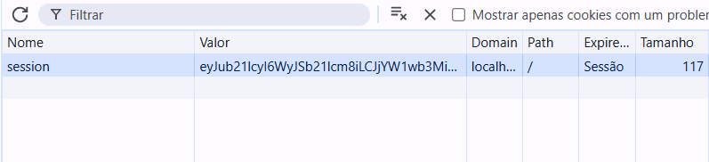

# Sessões

---

## Sessões

- O que são sessões?
- Como funcionam no Flask?
- Como configurar uma `secret_key`
- Exemplos práticos
- Desafio final

---

## Sessões

- Mecanismo de **armazenamento temporário de dados** entre requisições HTTP.
  - O protocolo HTTP não tem estado, as requisições são independentes.
- Utilizado para **manter estado** entre requisições de um mesmo cliente.
- Dados da sessão são **armazenados no lado do servidor**, com uma **referência via cookie**.
    - Um cookie é criado no navegador e possui os dados serializados (criptografia)
    - É possível ver o valor do cookie, mas não pode modificá-lo (torna-se inválido)

---

## Sessões

- O Flask utiliza cookies baseados em sessões.
- Os dados que adicionamos na sessão são enviados como cookies para o lado cliente (não podemos ver quais são os dados)
- Podemos checar o tamanho do cookie e analisar quando novas informações são adicionadas
  - O tamanho máximo do cookie pode ser uma limitação de armazenamento (Geralmente 4KB por cookie [ver](https://developer.mozilla.org/en-US/docs/Web/HTTP/Guides/Cookies#data_storage)) para resolução de alguns problemas.


---

## Sessões

- No [Exemplo 02](https://github.com/RomeritoCamposProjetos/web-2025/tree/main/slides/05/exemplo2), você pode adicionar nomes via formulário e ver na coluna **Tamanho** que o valor vai aumentar para o cookie `session`.

<div class="wrapper">



Fonte: própria.

</div>

- Baixo o código e realize os testes

---

## Sessões 

- Flask usa o objeto `session` para manipular dados de sessão.
- Os dados da sessão são assinados criptograficamente.
- É necessário definir `app.secret_key`.

```python
from flask import Flask, session

app = Flask(__name__)
app.secret_key = 'sua_chave_secreta_segura'
```
- A secret_key deve ser mantida em segredo.
- Ela garante que os dados da sessão não sejam modificados por terceiros.

---

## Sessões

- Uma forma de gerar chaves secretas é definida como a seguir:
```python
python -c 'import secrets; print(secrets.token_hex())'
```

- Uma chave será gerada o você pode utilizar em seu projeto.

- A seguir temos alguns exemplos de código mostrando operações no objeto `session.`

- No [Exemplo 01](https://github.com/RomeritoCamposProjetos/web-2025/tree/main/slides/05/exemplo1), você pode ver alguns detalhes de implementação.

---

## Sessões

- Exemplo de como adicionar dados a uma sessão.

```python
from flask import Flask, session, redirect, url_for

@app.route('/login')
def login():
    session['usuario'] = 'Maria'
    return 'Usuário logado!'
```

- O dado adicionado é o nome `"Maria"` e foi associado a **chave** `usuário` dentro da sessão.

---

## Sessão

- Aqui tentamos acessar a chave `usuario` e o obter o dado referente a a ela.

```python
@app.route('/perfil')
def perfil():
    usuario = session.get('usuario')
    if usuario:
        return f'Bem-vindo, {usuario}!'
    return 'Nenhum usuário logado.'
```

- `session.get()` retorna `None` se a chave não existir (evita erro).
---

## Sessão

- Para remover dados da sessão basta utilizar o método `pop()`.

```python
@app.route('/logout')
def logout():
    session.pop('usuario', None)
    return 'Usuário deslogado.'
```
- `session.pop('chave', None)` remove a chave da sessão se existir
- Adicionamos `None` para o caso de não existir a chave que queremos remover.

---

## Sessões

- Além dos recursos anteriores, podemos adicionar um tempo de vida para que a sessão seja encerrada por inatividade.
- No [Exemplo 02](https://github.com/RomeritoCamposProjetos/web-2025/tree/main/slides/05/exemplo2), este tempo está definido para 2 minutos. O código abaixo resumo o que deve ser feito:

```python
from datetime import timedelta
app.permanent_session_lifetime = timedelta(minutes=30)

@app.route('/')
def index():
    session.permanent = True  # ativa tempo de vida configurado
    ## aqui removi o código do exemplo
    return render_template('form.html', nomes=session['nomes'])
```

---

## Sessões

- O que vai acontecer no [Exemplo 02](https://github.com/RomeritoCamposProjetos/web-2025/tree/main/slides/05/exemplo2)?

1° - Enquanto você adicionar nomes a lista, ela vai recebendo estes nomes e a página inicial conterá uma lista com todos eles.

2º Se você ficar 2 minutos inantivos e atualizar a página, então a lista estará vazia.

- Este é  o comportamento quando definimos um tempo máximo de vida útil para a sessão.