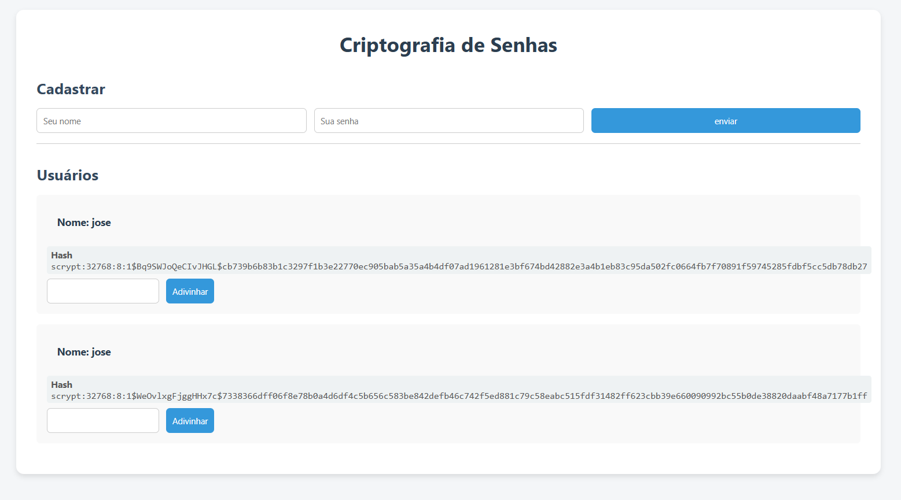

# Autenticação de Usuários

---

## Conteúdos

- Autenticação de Usuários
- Segurança de Senhas
- Flask-Login
    - Instalação e Configuração
    - Configuração de classe de usuário
    - Proteção de Rotas

--- 

## Autenticação de Usuários

---

## Autenticação de Usuários

- As aplicações modernas oferecem experiências personalizadas.
- Dessa maneira, é possível realizar o cadastro na aplicação e realizar os serviços oferecidos além de personaliações.
- Para realizar o cadastro, é necessário fornecer algumas informações e principalmente uma senha.
- É nesse ponto que precisamos focar a nossa atenção devido as questões de segurança.

---

## Autenticação de Usuários

- O processo de cadastro de usuários e, posteriomente, seu ingresso na aplicação utilizando, digamos, um email e uma senha é chamado de **autenticação**.
- Na autenticação, buscamos validar credenciais de acesso que definem os usuários de forma única como emails, matrículas ou alguma outra informação que seja única.
- Um ponto importante neste processo é garantir que a senha do usuário seja bem protegida.

--- 

## Autenticação de Usuários

Neste material, teremos 2 exemplos:
- Uso do pacote `werkzeug` para criptografia de senhas - [Exemplo 01]()
- Uso do pacote `Flask-Login` para gerenciamento de sessões de usuário - [Exemplo 02]()

---

# Segurança de Senhas

---

## Segurança de Senhas

- Um aspecto importante sobre o sistema de autenticação de usuários é a forma de lidar com a senha do usuário.
- É comum sistemas que retornam uma string com a senha literal do usuário diante de um pedido de recuperação. 
- Esta é uma falha de segurança muito importante.
- Muitos usuários acabam repetindo senhas em diferentes serviços e logo teriam tudo exposto em caso de vazemanto da senha.

---

## Segurança de Senhas

- No [Exemplo 01](https://github.com/RomeritoCamposProjetos/web-2025/tree/main/slides/06/exemplo1), a aplicação mostra um ténica de segurança importante que é a geração de **hash** a partir da senha do usuário.
- Quando geramos um **hash** não temos como desfazê-lo para saber qual o valor que o gerou.
- O que podemos fazer é o seguinte:
  - dada a informação original (por exemplo, a senha), checar se o hash foi gerado a partir dela.
- Este mecanimo adiciona uma boa camada de segurança já que o sistema não salva a senha do usuário.

---

## Segurança de Senhas

- No [Exemplo 01](https://github.com/RomeritoCamposProjetos/web-2025/tree/main/slides/06/exemplo1), você salva nome e senha de usuários na sessão e pode verificar as senhas paa cada um deles.
- A partir destas funcionalidades,  é possível ver o processo de geração e vefiicação de hash através do módulo `werkzeug.security`.
- A seguir, os principais aspectos serão apresentados.
- Baixe o código e execute-o na para avaliar as funcionalidades.

---

## Segurança de Senhas

- Para usar o módulo `werkzeug.security` é necessário importar as funções que usaremos.
```python
from werkzeug.security import generate_password_hash, check_password_hash
```
- Pelos nomes, já podemos ver o propósito de cada uma delas. 
  - `generate_password_hash`:  é usada para gerar hashs, e;
  - `check_password_hash`: verifica se um hash foi gerado a partir de uma senha informada.
- Na página seguinte, veja uma imagem da aplicação com um usuário adicionado.

---

## Segurança de Senhas

<div class="wrapper">



Fonte: própia

</div>


---

## Segurança de Senhas

- O usuário pode enviar novos cadastros que serão processados pela view `index`.

- O ponto principal é a geração do hash a partir da `senha` 

```python
# trecho de cripto.py
dados = {
    'nome': nome,
    'senha': senha,
    'hash': generate_password_hash(senha)
}
lista.append( dados )
```

---

## Segurança de dados

- Os dados do usuário serão mostrados na tela e você pode tentar adivinhar a senha. A view `adivinhar` recebe as requisições.

```python
# trecho de cripto.py
if user['nome'] == nome and check_password_hash(user['hash'], senha):
    flash('Você acertou a senha', 'success')
    return redirect(url_for('index'))
```

- O trecho acima vai verificar se o `hash` foi gerado a partir da `senha` que você supõe ser a correta. 

---

# Flask-Login

---

## Flask-Login

- A extensão `Flask-Login` tem o objetivo de gerenciar as sessões de usuário no sistema de autenticação. Veja mais [aqui](https://flask-login.readthedocs.io/en/latest/).
- Desta maneira, ao fazer login no sistema o usuário será lembrado a medida que navega pelas páginas sem a necessidade fazer login novamente (a menos que a sessão expire)
- Podemos juntar os recursos do **Flask-Login** com o módulo `werkzeug.security` para oferecer uma experiência mais segura.
- Neste exemplo, **vamos manter uma lista de usuários simulando banco de dados.**

---

## Flask-Login

- Alguns aspectos devem ser levados em consideração 
    - É necessário instalar o pacote
    - É necessário ter um **Modelo** preparado para ser usado no Flask-Login
    - Vamos proteger as rotas de acesso indevido (usuários não logados)
    - Vamos preprar o ambiente de cadastro e login de usuário de acordo com o recursos oferecidos pelo flask
- Um ponto importante é que usaremos um Modelo. Entretanto, não adotaremos banco de dados.
---

## Instalação e Configuração

- A primeira coisa a ser realizada é a instalação do pacote Flask-Login 
```
pip install Flask-Login
```
- Este pacote oferece o gerencimanento de login/logout de usuários e controle de acesso a rotas protegidas.
- É necessário incorporar outros pacotes de funcionalidades para tornar a autenticação de usuários mais completa

---

# Instalação e Configuração

---

## Instalação e Configuração

REFAZENDO

- Para facilitar o entendimento da extensão, acesso o código de exemplo na íntegra [aqui](./exemplo02/)

- Neste código, o banco de dados utilizado foi o SQLITE e as funcionalidades da aplicação consistem basicamente em cadastrar e fazer login de usuários. Quando o usuário está logado, ele pode usar o logout da aplicação para sair.

- Dois pontos fundamentais na fase de configuração são:
    - Realizar o import das classes e funções da extensão
    - Preparar o **modelo** de usuário da aplicação

---

## Instalação e Configuração

- Considerando que o pacote foi instalado podemos utilizá-lo da seguinte forma:

```python
from flask_login import LoginManager, login_user, login_required, logout_user
login_manager = LoginManager() # fazer integração com FLask
app = Flask(__name__)
login_manager.init_app(app) # inicializar o app associado a FLask-Login
app.config['SECRET_KEY'] = 'ULTRAMEGADIFICIL'
```

- Vejamos os detalhes desta etapa

---

- A classe LoginManager é responsável por integrar o FLask ao Flask-Login

```python
login_manager = LoginManager()
```
- Esta classe vai gerenciar a sessão do usuário e também vai gerenciar a maneira como recuperamos um usuário com base no seu `id` que está na sessão

- Como será utilizada sessões, então é necssário cofigurar uma chave secreta:

```python
app.config['SECRET_KEY'] = 'ULTRAMEGADIFICIL'
```
---

## Instalação e Configuração

- O próximo passo é definir um **Modelo User**

- O acesso a banco de dados na aplicação nos leva em geral a ter que lidar com código SQL. 

- Uma forma de abstrair isso da programação é definir uma *camada* de acesso a banco de dados onde definimos modelos. 

- Os modelos são classes que possuem a habilidade de lidar com o banco de dados e em geral seus atributos representam as colunas que temos no banco.

---

- Nesse sentido, temos a classe User no módulo `models`.

- Esta classe possui vários recursos como uso do decorator @property e também do decorator @classmethod.

- Se você observa o código das views e pensar o pouco sobre como é fácil usar o modelo User para fazer operações no banco, vai entender porque a classe User tem esta implementação.

- Uma vez que o modelo User foi criado e "testado", ele pode ser usado como parte de um módulo python onde apenas utilizamos suas funções.

---

- O módulo user tem relação direta com o código abaixo, que faz parte da configuração do Flask-Login:

```python
@login_manager.user_loader
def load_user(user_id):
    return User.get(user_id)
```

- O FLask-Login vai utilizar esta função `load_user` para recuperar os dados de um usuário a partir de `user_id` salvo na sessão (lembre-se que este é seu papel)

- Na implementação do exemplo, obtém por encapular o acesso ao banco de dados e busca pelo usuário na classe User. 

---

- Já vimos que é necessário ter esse modelo User, agora vamos examiná-lo. Veremos o código por partes:

```python
class User(UserMixin):
    _hash : str
    def __init__(self, **kwargs):
        self._id = None
        if 'email' in kwargs.keys():
            self._email = kwargs['email']
        if 'password' in kwargs.keys():
            self._password = kwargs['password']
        if 'hash' in kwargs.keys():
            self._hash = kwargs['hash']
```

- O modelo herda de MixIn que é uma classe presente no Flask-Login. Mais detalhes em seguida.

- Além disso define 4 atributos, um extra que é a senha do usuário.

---

- A classe User herda de MixIn para ter as implementações padrões das funções abaixo ([Documentação](https://flask-login.readthedocs.io/en/latest/#your-user-class)):
    - `is_authenticated`
    - `is_active`
    - `is_anonymous`
    - `get_id`

- No exemplo do material, foi necessário sobrescrever a função `get_id` porque o atributo id foi definido como `_id` na classe User.

```python
def get_id(self):
        return str(self._id)
```

---

- Outro ponto importante é uso do decorator `@property`

- Este foi um artificil para criar objetos do usuário e já definir o hash da senha e esconder a senha original. Dado o código abaixo:
```python
@property
def _password(self):
    return self._hash
```
- Esta propriedade permite acessar o valor de `_password`, mas retora o valor de `_hash`. Logo, o valor exibido será o hash da senha: 

```python
print (user._password) # considerando um objeto User atribuído a user
```

---

- Além disso, também criamos uma forma de obter o valor da senha do usuário utilizando `@property.setter`: 

```python
@_password.setter
def _password(self, password):
    self._hash = generate_password_hash(password)       
```

- Desta maneira, quando o código abaixo for executado para uma atribuição de senha:

```python
user._password = '123123'
```

- Valor da senha em `user_.password` será o hash de `123123`

---

- Na classe User três métodos de classe foram definidos (neste caso são métodos que não precisam de um objeto de classe).

- Podemos ter o seguinte:

```python
User.get(10) # tentar recuperar no banco um usuário com id=10
User.get_by_email(email) # recuperar usuário do banco por email
User.all() # recupera todos os usuários do banco
User.exists(email) # Retorna True se um usuário existe
```

- As operações acima encapsulam o que já utilizamos do SQLITE

- São declarações que usam diretamente o nomda classe sem precisar de objetos

---

- Por fim, temos uma operação que pode ser utilizada a partir de um objeto.

- Ela é util quando formos preprar um objeto para ser salvo no banco (ou seja cadastrar um usuário).

```python
user = User('romero', '123123123')
user.save() 
```

- Neste caso, a operação `save()` precisa de um objeto. A implementação de `save()` é basicamente o que já fizemos com cadastros em geral.

---

## Proteção de Rotas

- Podemos partir para a próxima etapa que é proteger as rotas que desajarmos. No arquivo app.py veja o código: 

```python
@app.route('/dashboard')
@login_required
def dash():
    return render_template('pages/dash.html')
```

- Importarmos `login_required` de Flask-Login e decoramos a rota 

- Agora apenas usuários logados pode acessar esta rota.

---

## Cadastro de Usuário

- O cadastro de usuário é simples. Os formulários e  manipulação do banco contiuam iguais, apenas estão encapsulados na classe `User`.

- Há uma rota para registro e o trecho mais importante é o seguinte:


```python
#trecho de app.py | view register
if not User.exists(email):
    user = User(email, password)
    user.save()            
    # 6 - logar o usuário após cadatro
    login_user(user)
    flash("Cadastro realizado com sucesso")
    return redirect(url_for('dash'))
```
---

- A primeiro coisa a fazer ao tentar um novo cadastro é checar se o usuário já exite.

- Caso não existe, um objeto `user` é criado.

- Em seguida, ele salva os dados do novo usuário no banco `user.save()`

- O usuário é logado por meio de `login_user(user)`, que é uma função da extensão Flask-Login

- O usuário é redirecionado para o dashboard.

---

## Login de Usuário

- O login de usuário também é simples. Destaca-se da função de login o código abaixo:

```python
user = User.get_by_email(email)
if check_password_hash(user._hash, password):
    login_user(user)
    flash("Você está logado")
    return redirect(url_for('dash'))
```
- O usuário que tenta fazer login é verificado no banco.

- Em seguida, é necessário testar a senha.

---

- Neste ponto, aplica-se a função `check_password_hash` considerando a hash do `user` recuperado do banco de dados e a senha enviada pelo formulário.

- Caso haja sucesso, então a função `login_user` da extensão Flask-Login é usada e o usuário está logado.

- O usuário é redirecionado

- Caso contrário, ele recebe de volta o formulário

---

## Logout de usuário

- O logout de usuários também utiliza uma função da extensão Flask-Login

- Observe o código abaixo:

```python
@app.route('/logout')
@login_required
def logout():
    logout_user()
    return redirect(url_for('index'))
```

- A função `logout_user()` foi aplicada e a sessão encerrada.

---

## Acessando o usuário logado

- A Extensão Flask-Login permite consultar o usuário logado através do objeto `current_user`

```python
from flask_login import current_user
```

- Na página `index.html` temos um código que mostrar os links de cadastro e login de usuário se não houver ninguem logado.

- Veja o código a seguir

---

- O trecho de código abaixo vai mostrar dois links se não houver usuário autenticado


