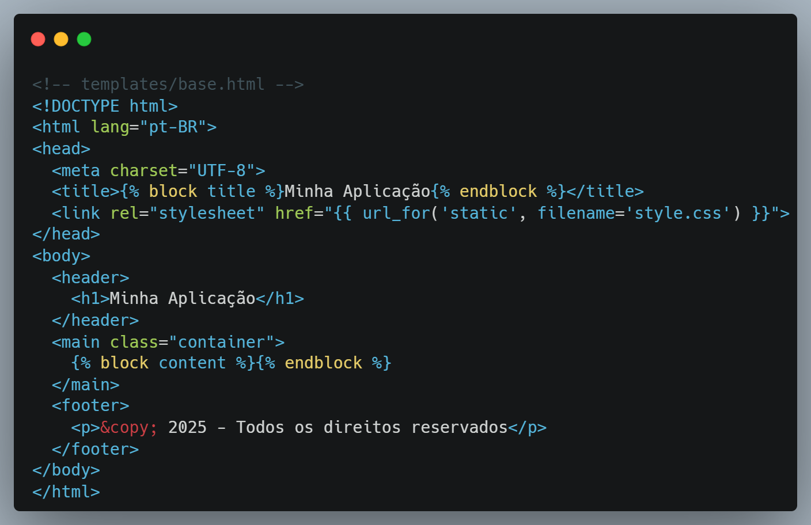
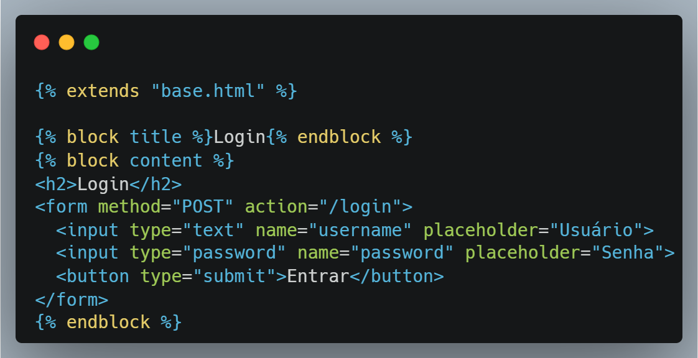
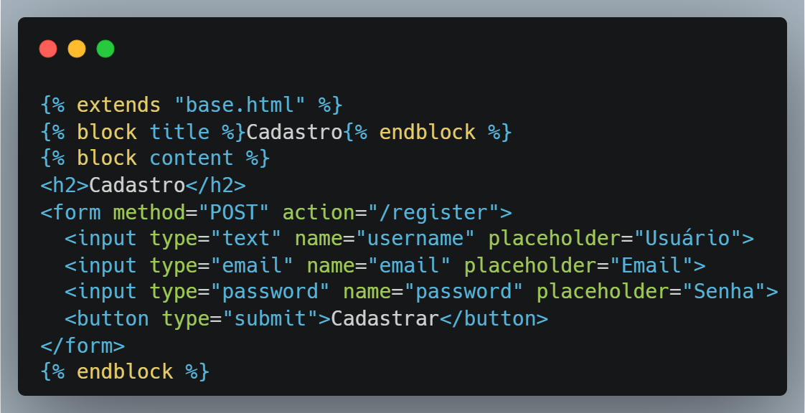
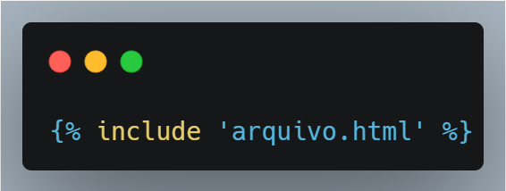
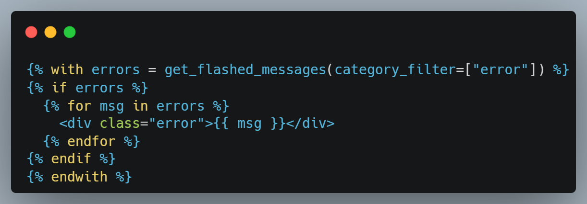
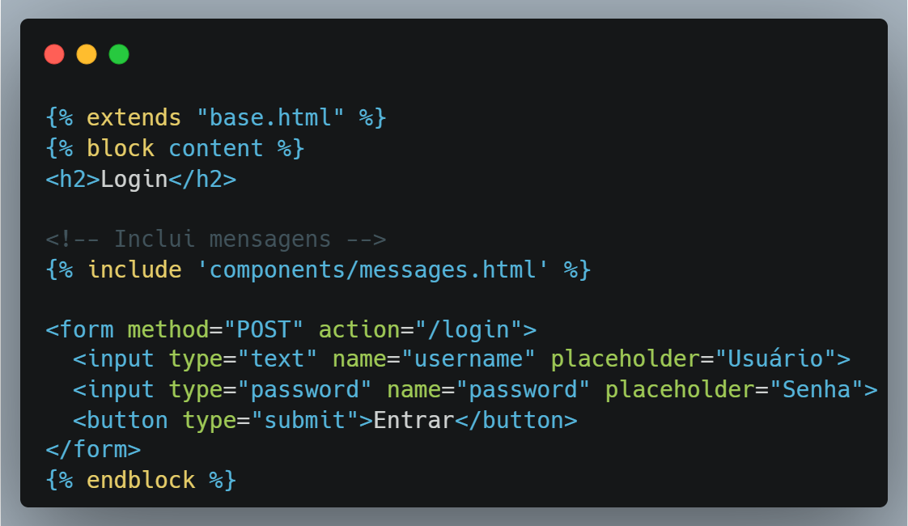
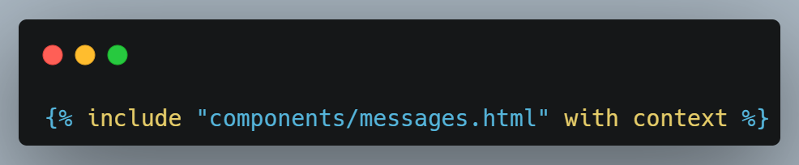

# Templates no Flask


---

## Templates no Flask

- Usando Jinja2 para separar lógica da apresentação  
- Exemplos com páginas de login e cadastro de usuários

---

## Templates no Flask

- O que são templates?
- Templates simples com `render_template`
- Herança de templates
- Blocos (`block`, `endblock`)
- Componentes com `include`
- Exemplo: Login e Cadastro com HTML + CSS

---

## Templates no Flask

Flask usa [Jinja2](https://jinja.palletsprojects.com/en/stable/) como engine de templates.

```python
from flask import Flask, render_template

app = Flask(__name__)

@app.route("/")
def home():
    return render_template("index.html")
```

- No [Exemplo 01](https://github.com/RomeritoCamposProjetos/web-2025/tree/main/slides/07/exemplo1), os conceitos fundamentais de templates são apresenados.

- Consulte a documentação do [Jinja](https://jinja.palletsprojects.com/en/stable/) para aprofundar os conhecimentos de outras diretivas úteis para criação de páginas.

---

# Herança de Templates

---

## 🧠 O que é herança de templates?

- Herança de templates é um recurso do **Jinja2** (a engine de templates usada pelo Flask) que permite **evitar duplicação de código HTML** ao reutilizar uma estrutura base comum em várias páginas.

- Ela funciona como um "molde":
    - Um **template base** define a estrutura comum (HTML, cabeçalho, CSS, etc.)
    - Os outros templates **herdam** essa estrutura e **preenchem blocos específicos**

---

## 🎯 Quando usar herança?

- Sempre que você tiver várias páginas com **layout semelhante** (ex: mesmas cores, mesma navbar, mesmo rodapé), mas **conteúdos diferentes**, como:
    - login.html
    - register.html
    - dashboard.html
    - perfil.html

---

### 📄 Template Base (base.html)

<div class="wrapper">



</div>

---

### O que são os `block`?

- São **marcadores de substituição**.
- Quem **herda** esse template pode **preencher ou sobrescrever** esses blocos.
- Por exemplo, no slide anterior foram definidos os seguintes blocos de substituição:
    - `title`
    - `content`
- A seguir dois exemplos são apresentados: `login.html` e `regsiter.html`
    - Ambos utilizam como layout o conteúdo que está no arquivo `base.html`
    - Em cada arquivo HTML, os formulários de login e cadastro são personalizados para atender aos requisitos das respectivas operações.

---

### O que são os `block`?

#### Regras Importantes

- O nome do bloco no filho deve ser igual ao do base:
Ex: block content substitui o block content da base.
- Você pode deixar conteúdo padrão no bloco base:
Se o filho não sobrescrever, o conteúdo padrão será usado.
- Você pode ter quantos blocos quiser
Ex: navbar, sidebar, scripts, etc.

<p class="nota">
Os blocos são fundamentais para composição de páginas durante a herança de templates.
<p>

---

### 📄 Template filho: login.html


<div class="wrapper">



</div>

- `extends"` → diz que este arquivo **herda** de `base.html`
- `block title` → define o título da aba do navegador
- `block content` → insere conteúdo específico da página

---

### 📄 Template filho: login.html

- A página `login.html` herda toda a estrutura de `base.html`.
- Substitui o bloco `title` com "Login"
- Substitui o bloco `content` com o formulário

---

### 📄 3. Template filho: register.html

<div class="wrapper">



</div>

- Note que apenas o conteúdo do formulário de cadastro foi modificado. Todo o restante da página é o mesmo (heradado do template base).

---

### ✅ Benefícios da Herança

- **Evita repetição** de HTML (não precisa repetir `<html>`, `<head>`, CSS, etc.)
- **Fácil manutenção**: mude o layout em um lugar só (`base.html`)
- **Organização melhor** do código
- Ao utilizarmos as estrutras bloco (`block`),  podemos focar exclusivamente no que precisa ser construído com base no objetivo da página

---

# include

Componentes reutilizáveis

---

## 🔹 O que é `include`?

- `include` é uma **forma de importar um trecho de HTML** de outro arquivo **dentro de um template maior**.

<div class="wrapper">



</div>

---

## 🔹 O que é `include`?

- Serve para **componentizar** e **evitar repetição**, especialmente em partes como:
- mensagens de erro/sucesso
- cabeçalhos ou rodapés
- formulários reutilizáveis
- menus e navbars
- cartões, tabelas, blocos informativos

---

## 📄 Exemplo básico

### Componente: `messages.html`

<div class="wrapper">



</div>

- Este componente será utilizado para melhorar as mensagens apresentadas durante o uso do formulário de login.

--- 


### Usando em `login.html`

<div class="wrapper">



</div>

- Fazemos a inclusão do componente definido em `messages.html` logo ele aparecerá na página de acordo com a situação: **sucesso** ou **erro**.

---

### 🧠 Como funciona?

O **`include` literalmente copia o conteúdo do arquivo indicado** para dentro da posição onde foi chamado.

> Pense como um *“cola-e-copia ao renderizar”*.

### 🧾 Vantagens do `include`

| Vantagem        | Explicação                                                                |
| --------------- | ------------------------------------------------------------------------- |
| 🔁 Reutilização | Você pode usar o mesmo bloco de HTML em várias páginas                    |
| 🛠️ Organização | Melhora a legibilidade dos arquivos                                       |
| ⚙️ Manutenção   | Alterações centralizadas (altere um arquivo e todas as páginas atualizam) |

---

## 👀 Dica avançada

- Você também pode passar variáveis para o `include`, se necessário:

<div class="wrapper">



</div>

- O `with context` (opcional) garante que o include receba as mesmas variáveis do template onde está sendo chamado.

---

## ❗ Diferença entre `include` e `extends`

| Recurso   | Função principal                           |
| --------- | ------------------------------------------ |
| `extends` | Herda estrutura completa com blocos        |
| `include` | Insere trechos específicos de HTML prontos |